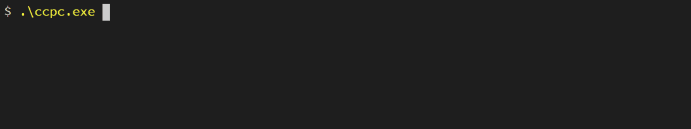

# ccpc: crypto coin price checker

ccpc is a command line utility to list crypto prices in a ticker format. It utilizes the Coin Gecko API.

## Usage
Feed ccpc a list of crypto symbols and it will produce one ticker for each coin. The basic usage is:

```
ccpc symbol(s) [options]
```

The default output contains the coin symbol, the coin name, the price against USD and whether or not it is up or down in the last 24 hours (color-coded), and the time that the data was updated. 



The `-maximum` flag (`-m`) will include more information per ticker.


The `--target` flag (`-t`) will change the target currency to anything supported by the API. Using the `--list-currencies` flag will list all of those supported currencies.


In update mode, ccpc will keep the same list of tickers on screen and update them at a specified interval (`-d` specifies the interval). In this way it could be used as a static readout on a terminal. `CTRL-C` quits.


It can also generate a ticker for every symbol in a file by using the `--symbols-from-file` flag (`-f`).

## Supported flags

The following are supported in ccpc:

```
-a, --all
        Yields listings for all known coins. (Generally not recommended)
  -b, --block-time
        Includes block time in the listing, if available.
  --list-coins
        Displays a listing of all known coins.
  --list-currencies
        Displays a listing of all known currencies.
  -m, --maximum
        Yields maximum detail listings for the selected coins.
  -c, --no-color
        Disables output colors.
  -n, --no-name
        Omits coin name in the listing.
  -z, --no-time
        Omits last update time in the listing.
  -p, --ping
        Pings the Coin Gecko API and shows the message.
  -f, --symbols-from-file string
        Loads a list of symbols from a text file, one symbol per line.
  -t, --target string
        Determines the target currency for comparison (e.g. usd, jpy). (default "usd")
  -d, --update-duration uint
        Sets the duraton (seconds) for the rate of update mode. (default 30)
  -u, --update-mode
        Updates the same set of tickers every no. of seconds.
  -v, --volume
        Includes coin volume in the listing, if available.
```